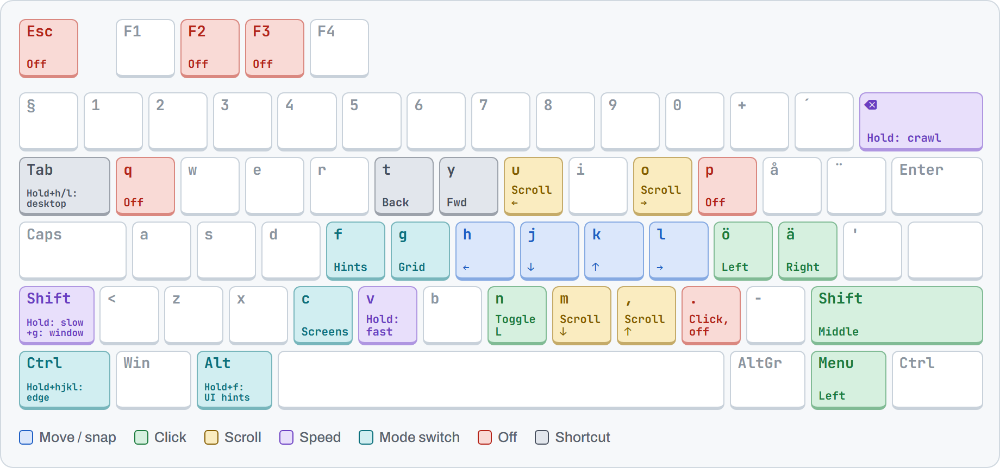
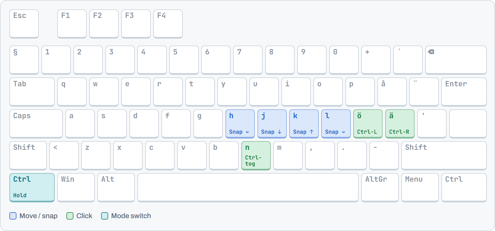
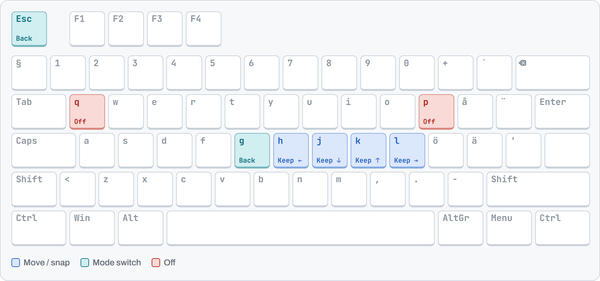
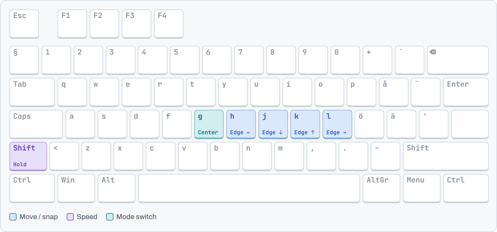
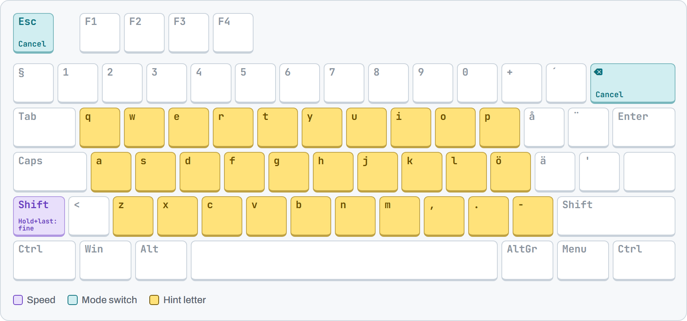
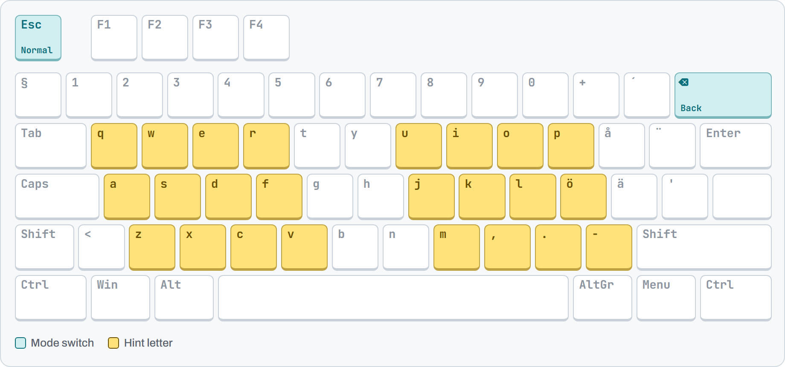
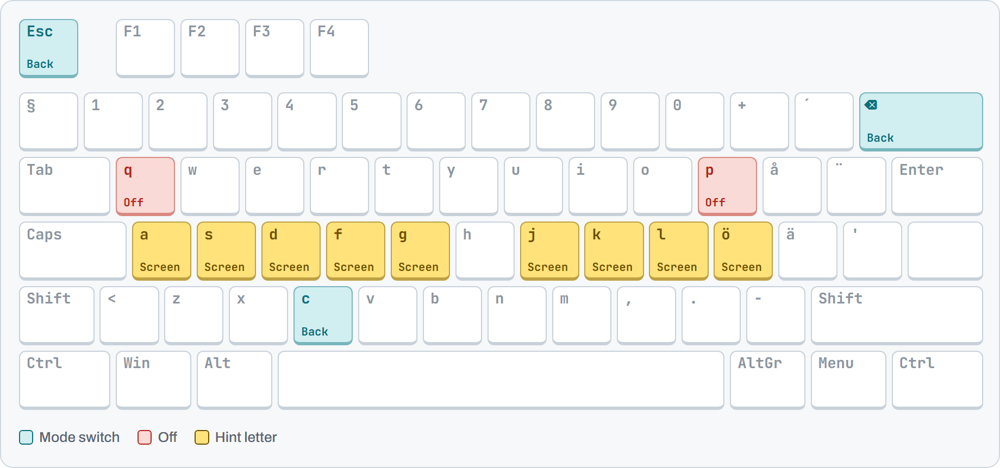
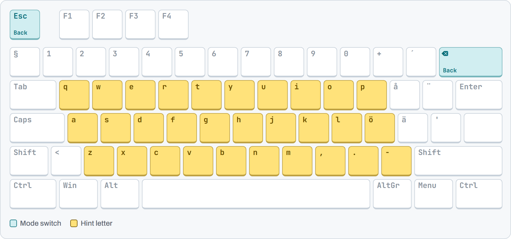
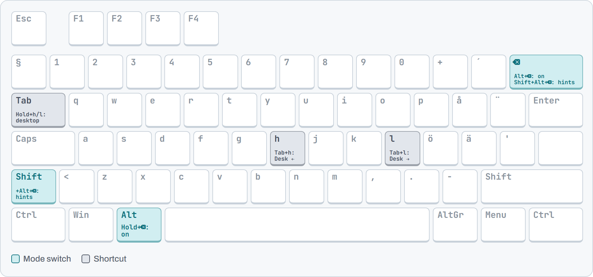

# vapid-mousemaster

My [mousemaster](https://github.com/petoncle/mousemaster) config: drive the mouse from the keyboard with Vim keys on a Swedish layout (`sv-qwerty`).

## Setup

Put `mousemaster.exe` from the [mousemaster releases](https://github.com/petoncle/mousemaster/releases) in this folder and start it from here. It reads `mousemaster.properties` from the working directory.

```powershell
cd C:\Apps\mousemaster
.\mousemaster.exe
```

## On and off

| Turn on | Turn off | Turn off, and the key still reaches the app |
|---|---|---|
| Hold <kbd>Left Alt</kbd>, press <kbd>⌫</kbd><br>Add <kbd>Shift</kbd> to start in hints | <kbd>q</kbd> <kbd>p</kbd> <kbd>Esc</kbd> <kbd>Alt</kbd>+<kbd>⌫</kbd><br><kbd>.</kbd> clicks, then turns off | <kbd>Ctrl</kbd>+<kbd>F</kbd> <kbd>Ctrl</kbd>+<kbd>L</kbd> <kbd>Ctrl</kbd>+<kbd>E</kbd><br><kbd>F2</kbd> <kbd>F3</kbd> <kbd>/</kbd> |

Indicator next to the pointer: 🔴 on · 🟡 scrolling · 🟢 button held.

## Keyboards

<picture>
  <source media="(prefers-color-scheme: dark)" srcset="images/normal-dark.png">
  
</picture>

<details><summary>Edge keyboard</summary>
<picture><source media="(prefers-color-scheme: dark)" srcset="images/edge-dark.png"></picture>
</details>
<details><summary>Grid keyboard</summary>
<picture><source media="(prefers-color-scheme: dark)" srcset="images/grid-dark.png"></picture>
</details>
<details><summary>Window keyboard</summary>
<picture><source media="(prefers-color-scheme: dark)" srcset="images/window-dark.png"></picture>
</details>
<details><summary>Hints keyboard</summary>
<picture><source media="(prefers-color-scheme: dark)" srcset="images/hint-dark.png"></picture>
</details>
<details><summary>Fine hints keyboard</summary>
<picture><source media="(prefers-color-scheme: dark)" srcset="images/fine-dark.png"></picture>
</details>
<details><summary>Screens keyboard</summary>
<picture><source media="(prefers-color-scheme: dark)" srcset="images/screen-dark.png"></picture>
</details>
<details><summary>UI hints keyboard</summary>
<picture><source media="(prefers-color-scheme: dark)" srcset="images/ui-dark.png"></picture>
</details>
<details><summary>Off keyboard</summary>
<picture><source media="(prefers-color-scheme: dark)" srcset="images/off-dark.png"></picture>
</details>

The images come from `images/keyboard.html`. After changing a binding, update `MODES` in that file and run `.\images\render.ps1` to regenerate every PNG with headless Chrome or Edge.

## Normal mode

Arrow keys do the same as <kbd>h</kbd> <kbd>j</kbd> <kbd>k</kbd> <kbd>l</kbd> for moving and snapping.

| Move | Click | Scroll | Speed (hold) |
|---|---|---|---|
| <kbd>h</kbd> left | <kbd>ö</kbd> or <kbd>Menu</kbd> left, hold to drag | <kbd>,</kbd> up | <kbd>v</kbd> fast |
| <kbd>j</kbd> down | <kbd>ä</kbd> right | <kbd>m</kbd> down | <kbd>Left Shift</kbd> slow |
| <kbd>k</kbd> up | <kbd>Right Shift</kbd> middle | <kbd>u</kbd> left | <kbd>⌫</kbd> crawl |
| <kbd>l</kbd> right | <kbd>n</kbd> toggle left button held | <kbd>o</kbd> right | |
| | <kbd>.</kbd> left-click and turn off | | |

| Shortcut | Does |
|---|---|
| <kbd>Ctrl</kbd> + any click key | Ctrl-click |
| <kbd>t</kbd> / <kbd>y</kbd> | Back / forward (sends <kbd>Alt</kbd>+<kbd>←</kbd> / <kbd>Alt</kbd>+<kbd>→</kbd>) |
| <kbd>Tab</kbd>+<kbd>h</kbd> / <kbd>Tab</kbd>+<kbd>l</kbd> | Previous / next virtual desktop. Works when mousemaster is off too |

## Other modes

| Mode | Enter | Keys inside | Leave |
|---|---|---|---|
| **Edge** | hold <kbd>Left Ctrl</kbd> | <kbd>h</kbd><kbd>j</kbd><kbd>k</kbd><kbd>l</kbd> jump to that screen edge | release Ctrl |
| **Grid** | <kbd>g</kbd> | <kbd>h</kbd><kbd>j</kbd><kbd>k</kbd><kbd>l</kbd> keep that half, pointer follows its centre | <kbd>g</kbd> <kbd>Esc</kbd> back · <kbd>q</kbd> <kbd>p</kbd> off |
| **Window** | hold <kbd>Left Shift</kbd>, press <kbd>g</kbd> | <kbd>h</kbd><kbd>j</kbd><kbd>k</kbd><kbd>l</kbd> jump to that window edge · <kbd>g</kbd> centre | release Shift |
| **Hints** | <kbd>f</kbd>, or <kbd>Shift</kbd>+<kbd>Alt</kbd>+<kbd>⌫</kbd> from off | type a label to jump there · hold <kbd>Shift</kbd> on the last letter for fine hints | pick a hint · <kbd>Esc</kbd> <kbd>⌫</kbd> |
| **Fine hints** | <kbd>Shift</kbd> + last hint letter | smaller grid around that spot, zoomed 5× | pick a hint · <kbd>Esc</kbd> back · <kbd>⌫</kbd> to hints |
| **Screens** | <kbd>c</kbd> | <kbd>j</kbd> <kbd>k</kbd> <kbd>l</kbd> <kbd>ö</kbd> <kbd>a</kbd> <kbd>s</kbd> … jump to that monitor | <kbd>c</kbd> <kbd>Esc</kbd> <kbd>⌫</kbd> back · <kbd>q</kbd> <kbd>p</kbd> off |
| **UI hints** | <kbd>Alt</kbd>+<kbd>f</kbd> | type a label on a button or link to jump to it | pick a hint · <kbd>Esc</kbd> <kbd>⌫</kbd> off |

- **Edge** snaps to an invisible box 80% wide and 95% tall in the middle of the screen, not the outermost pixel. Click keys still work, so Ctrl-click is available here.
- **Window** puts its top edge 15 px into the window, on the title bar, so you can grab it and drag.

## Tuning

| Speed | Hold | Pointer max | Acceleration | Wheel max |
|---|---|--:|--:|--:|
| Crawl | <kbd>⌫</kbd> | 75 | 800 | 50 |
| Slow | <kbd>Left Shift</kbd> | 350 | 800 | 200 |
| Normal | | 2 200 | 800 | 2 000 |
| Fast | <kbd>v</kbd> | 4 500 | 3 000 | 10 000 |

The pointer starts at 0 and accelerates. Scrolling starts at 1 500. While scrolling up or down, Shift slows the wheel and is not passed to the app, so apps don't read it as a sideways scroll.

| Screen | Hint cell (px) | Hint layout (rows × columns) | Fine hint cell (px) | Fine hint max (rows × columns) |
|---|--:|--:|--:|--:|
| 3840×2160 | 96×54 | 4×10 | 48×67.5 | 4×10 |
| 3440×1440 | 64×32 | 4×10 | 43×45 | 4×10 |
| 2560×1440 | 64×36 | 4×10 | 32×45 | 4×10 |
| Any other | 74×36 | 6×5 | 50×75 | 3×8 |

The three listed resolutions order hint letters home row first (`f j d k s l a ö …`). Other screens use keyboard order (`q w e r t …`).
